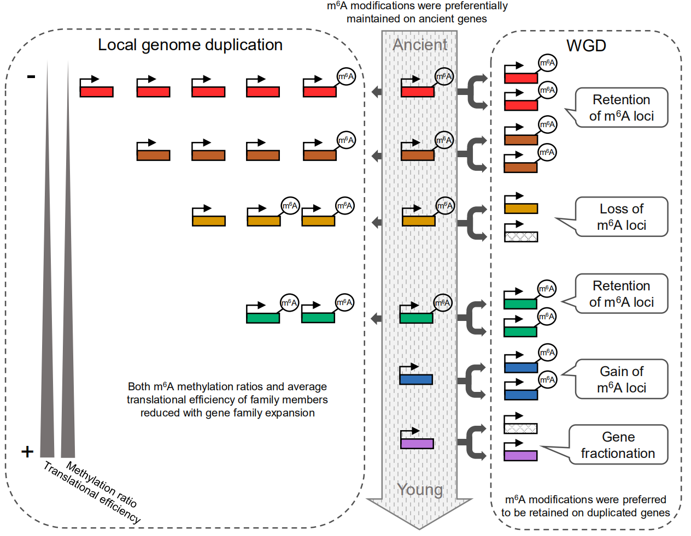

# m6A_Evolution
A bioinformatics pipeline for the evolution analysis of m<sup>6</sup>A in plants ([Miao *et al.* Molecular Biology and Evolution](https://academic.oup.com/mbe/advance-article/doi/10.1093/molbev/msab299/6388042?searchresult=1))

<div align="center"></div>

<div align="center"><b>Graphic illustration of the evolutionary implications of m<sup>6</sup>A methylome in plants</b></div>

### Directory structure

```
├── Part_1/
│   ├── ready_to_get_m6A_genes.R
│   ├── data1_m6A_peaks_genes.RData.gz
│   ├── ready_to_gene_attributes.R
│   ├── data2_gene_attributes.RData.gz
│   ├── sample_correlations.R
│   ├── part1_plots_m6A_ratios.R
│   ├── GO_enrichment.R
│   ├── figures
│   └── workflow/
│       ├── gene_list/: expressed genes and m6A genes
│       ├── m6Apipeline.sh: peak calling for strand-specific m6A-Seq data
│       ├── scripts/
│       │   ├── PEA_peak_calling.R
│       │   ├── diffbind2.R
│       │   ├── read_distribution_using_trumpet.R
│       │   ├── samples_gene_merge.R
│       │   ├── samples_peak_merge.R
│       │   ├── split.sh
│       │   └── split_c.sh
│       └── snakemake/: pipelines for public data
├── Part_2
│   ├── part2_plots_evolutionary_origins.R
│   └── figures
├── Part_3
│   ├── part3_plots_evolutionary_constraints.R
│   ├── KaKs_m6A_divergence.sh
│   └── figures
├── Part_4
│   ├── part4_plots_subgenome_divergence.R
│   └── figures
├── Part_5
│   ├── part5_plots_gene_expansions.R
│   └── figures
├── Part_6
│   ├── part6_plot_m6A_translation.R
│   └── figures
└── figure7.png
```

### How to access help

- For any feedback and suggestions, please feel free to leave a message at Github [issues](https://github.com/cma2015/m6A_Evolution/issues). We will try our best to deal with all issues as soon as possible.
- In addition, if any suggestions are available, feel free to contact: **Ting Zhang** [zting135@gmail.com](mailto:zting135@gmail.com) or **Chuang Ma** [chuangma2006@gmail.com](mailto:chuangma2006@gmail.com)

### Citation

Zhenyan Miao, Ting Zhang, Bin Xie, Yuhong Qi, Chuang Ma, Evolutionary implications of the RNA N6-methyladenosine methylome in plants, *Molecular Biology and Evolution*, 2021, msab299, https://doi.org/10.1093/molbev/msab299

